# Transparent and continuous user migration from one keycloak to another

> Keycloak to Keycloak User Federation.
> Import users, roles and groups stored in external Keycloak servers without downtime.


Note: this Keycloak extension is provided as an **paid option** for every managed keycloak subscriptions on [Cloud-IAM](https://www.cloud-iam.com/?ref=external-keycloak-user-provider-documentation).

# Getting Started

This tutorial will talk about two Keycloak cluster deployments:
- **Destination Deployment**: a fresh new deployment, without realms, users, roles and groups.
  

- **Source Deployment**: a deployment with production workload, contains all the customer current users, roles, groups that we would like to import to **Destination Deployment**.

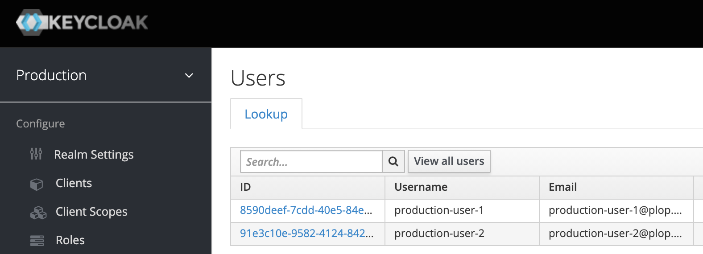
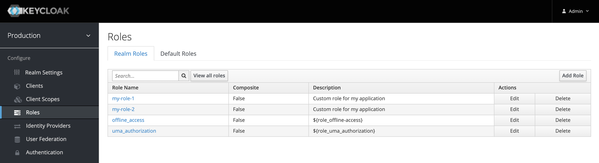

## Upload Keycloak custom extension

Once connected to Cloud-IAM dashboard, select the **Destination Deployment** that will import all users and upload the `import-keycloak-user-storage.jar` custom extension.

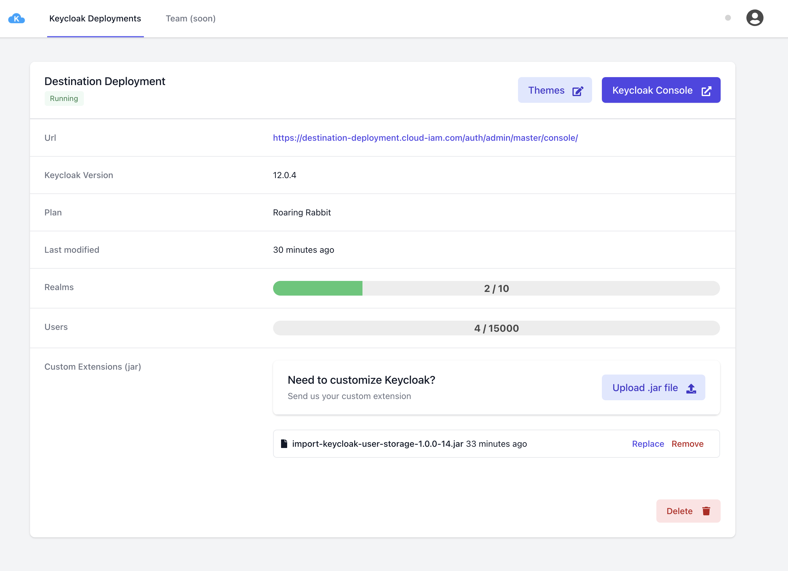

Cloud-IAM will then automatically update the **Destination Deployment** Keycloak nodes.  

## Import the realm

Export the realm configuration (groups, roles and clients) from the **Source Deployment**.

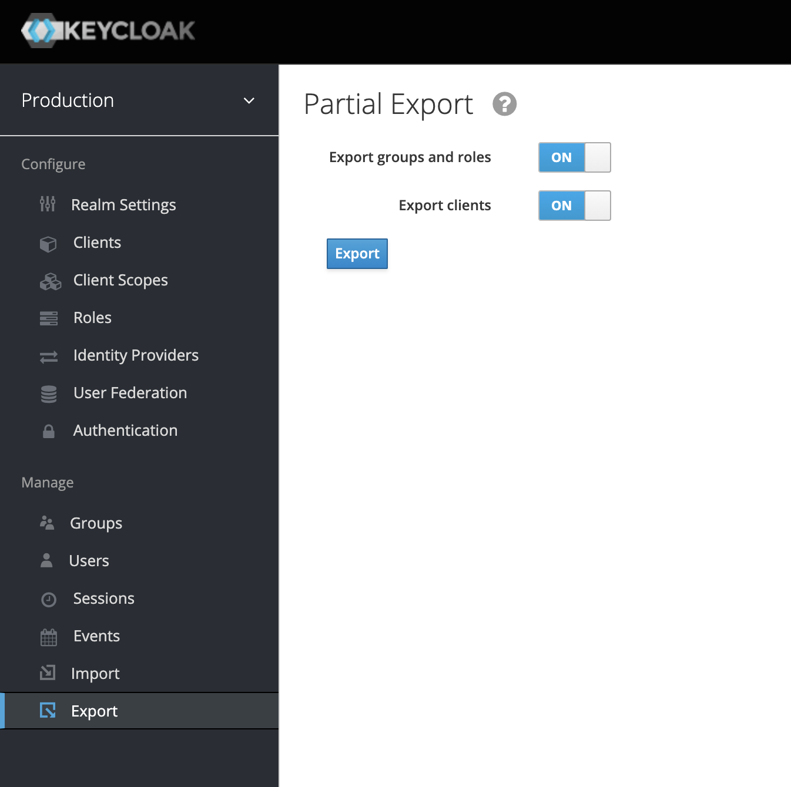


Inside **Destination Deployment** Keycloak console, create a new realm (realms list -> new) and specify in the realm creation form the previously exported realm file.

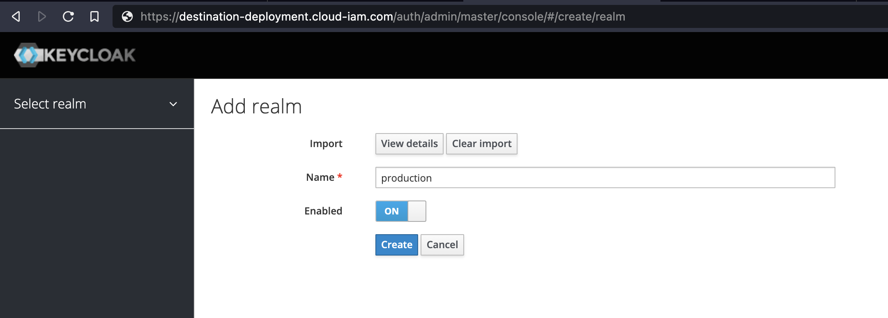

**Destination Deployment** now has new realm with the imported groups, roles and clients and **no users**.

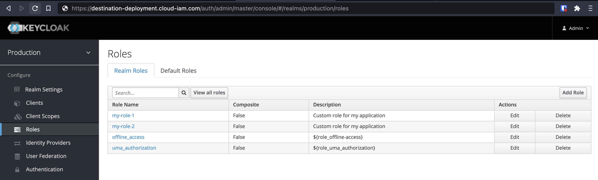

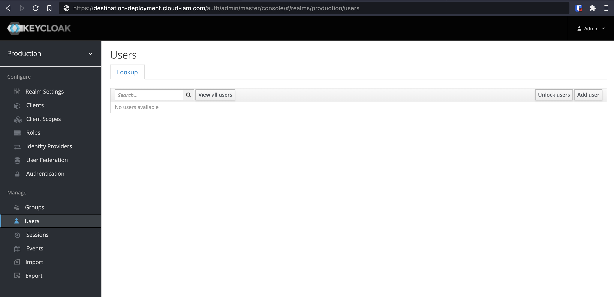

It's now time to setup the continuous import of users from **Source  Deployment** to our **Destination Deployment**.

## Setup User Federation

In **Destination Deployment** realm, create a new User Federation with our `external-keycloak-user-storage` provider.

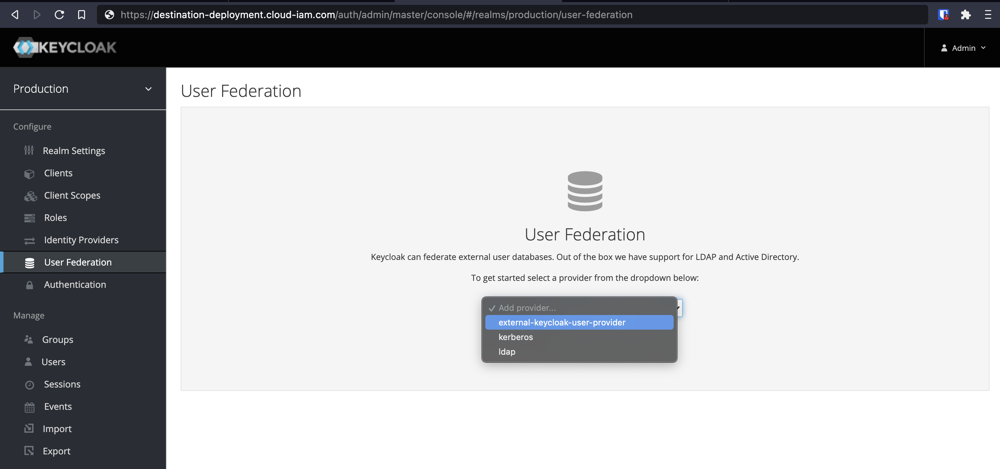

### Set database credentials

First double check that **Source Deployment** database can be accessed from **Cloud-IAM Destination Deployment** servers.

    Contact [Cloud-IAM support](mailto:support@cloud-iam.com) to receive your Keycloak cluster deployment IP addresses list and add them to the database connection allowlist.

Then type the **Source Deployment** database connection string using the following format:

```
jdbc:postgresql://{database_ip_address}:{database_port}/{database_name}
```

Don't forget to also check the realm name to import from **Source Deployment** in the *Original realm* input.

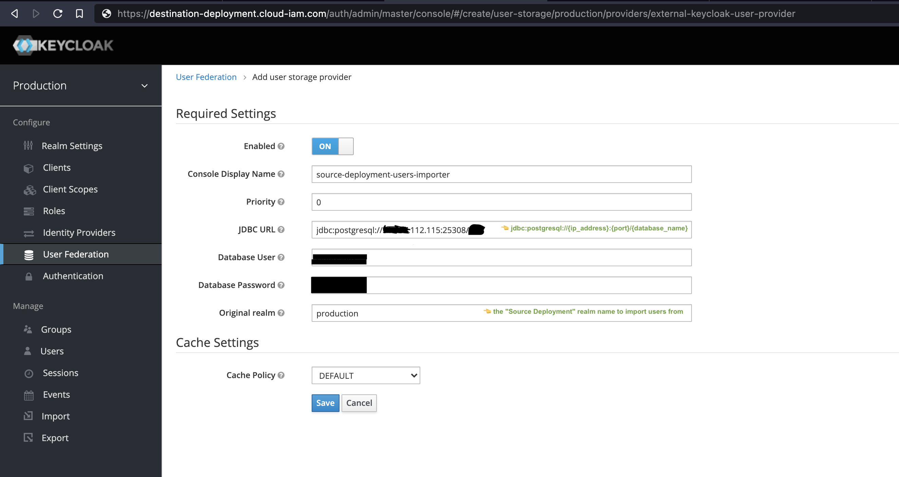

The **User Federation** extension is now fully configured and ready to import users from **Source Deployment**.

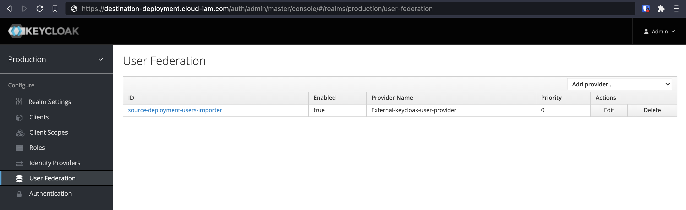

## Import our first user

Our **Source Deployment** has two users in the realm we wish to import, each one has a custom role `my-role-*` attached:

- username `production-user-1` (email `production-user-1@plop.com`)
    - assigned roles: `my-role-1` `offline_access` `uma_authorization`

- username `production-user-2` (email `production-user-2@plop.com`)
    - assigned roles: `my-role-2` `offline_access` `uma_authorization`

Logging in into **Destination Deployment** `production` realm with `production-user-1` credentials will automatically import it — along with its assigned groups and roles — from **Source Deployment** to **Destination Deployment**.

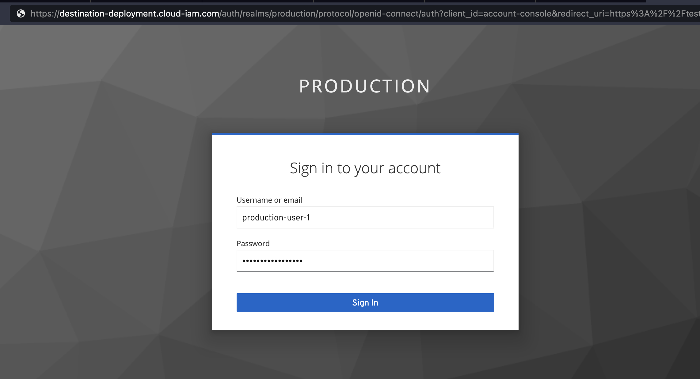

Each new user logged will be automatically imported into **Destination Deployment** destination realm.

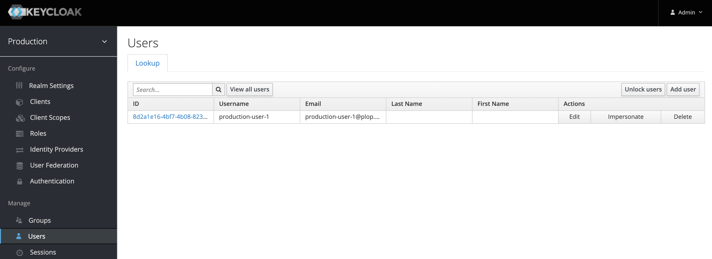

Each user is imported with its roles and groups automatically assigned.

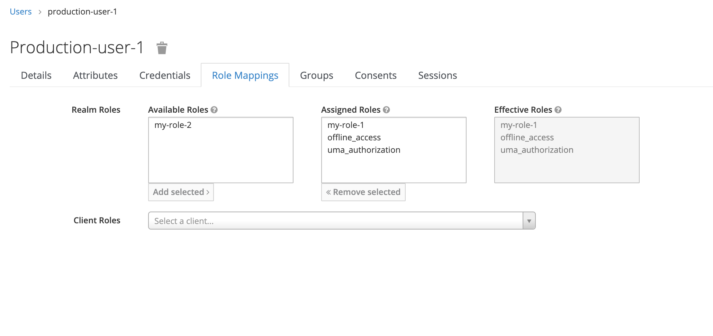

🎉 Congrats, your first user was imported!

# Known limitations

- Each new roles and groups created on **Source Deployment** **after** the realm creation and import on **Destination Deployment** won't be imported nor assigned to imported users.
